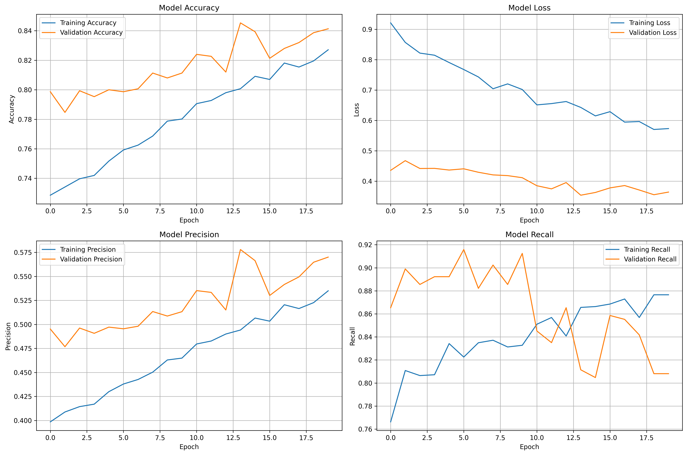

# Skin Lesion Classification using CNN

A comprehensive deep learning project for classifying skin lesions as benign or malignant using Convolutional Neural Networks (CNNs). This project includes data preprocessing, multiple CNN architectures, training pipelines, evaluation metrics, and visualization tools.

## Project Overview

This project implements a complete pipeline for skin lesion classification using the HAM10000 dataset, which contains 10,000 dermoscopic images of 7 different types of skin lesions. The main goal is to distinguish between benign and malignant lesions using state-of-the-art CNN architectures.

## Dataset Structure

After downloading the HAM10000 dataset, organize it as follows:

```
data/
├── HAM10000_images_part_1/     # Dermoscopic images (part 1)
│   ├── ISIC_0024306.jpg
│   ├── ISIC_0024307.jpg
│   └── ... (5000 images)
├── HAM10000_images_part_2/     # Dermoscopic images (part 2)
│   ├── ISIC_0029305.jpg
│   ├── ISIC_0029306.jpg
│   └── ... (5015 images)
└── HAM10000_metadata.csv       # Image metadata and labels
```

**HAM10000_metadata.csv columns:**
- `image_id`: Unique image identifier
- `lesion_id`: Lesion identifier (multiple images per lesion)
- `dx`: Diagnosis (7 types: nv, mel, bkl, bcc, akiec, vasc, df)
- `dx_type`: Diagnosis confidence level
- `age`: Patient age
- `sex`: Patient sex
- `localization`: Anatomical location

## Pre-trained Model

The trained ResNet50 model is available on Hugging Face:

**[devatreya/skin-lesion-resnet50](https://huggingface.co/devatreya/skin-lesion-resnet50)**

### Download and Run the Model

**Step 1: Install Dependencies**
```bash
pip install tensorflow huggingface_hub pillow numpy
```

**Step 2: Complete Inference Script**
```python
# Import required libraries
from huggingface_hub import hf_hub_download
import tensorflow as tf
import numpy as np
from PIL import Image

# Download model from Hugging Face
print("Downloading model from Hugging Face...")
model_path = hf_hub_download(
    repo_id="devatreya/skin-lesion-resnet50",
    filename="resnet50_best.h5"
)

# Load model
print("Loading model...")
model = tf.keras.models.load_model(model_path)

# Preprocess image function
def preprocess_image(image_path):
    """Load and preprocess image for ResNet50"""
    img = Image.open(image_path).convert('RGB')
    img = img.resize((224, 224))
    img_array = np.array(img, dtype=np.float32)
    
    # ResNet50 preprocessing (ImageNet/Caffe-style)
    img_array = img_array[..., ::-1]  # RGB to BGR
    mean = [103.939, 116.779, 123.68]
    img_array[..., 0] -= mean[0]
    img_array[..., 1] -= mean[1]
    img_array[..., 2] -= mean[2]
    
    return np.expand_dims(img_array, axis=0)

# Run inference
image_path = "path/to/your/lesion_image.jpg"  # Change this
img_array = preprocess_image(image_path)
prediction = model.predict(img_array)[0][0]

# Display result
print(f"\n{'='*50}")
print(f"Prediction: {'MALIGNANT' if prediction >= 0.5 else 'BENIGN'}")
print(f"Confidence: {prediction:.2%}")
print(f"{'='*50}")
```

**Medical Disclaimer:** This model is for educational and research purposes only. Not for clinical use. All suspicious lesions must be evaluated by qualified medical professionals.

---

## Quick Start

### Option 1: Use Pre-trained Model Only (Testing)

If you just want to test the model without training:

1. **Install dependencies**: `pip install tensorflow huggingface_hub pillow numpy`
2. **Use the complete script above** - it downloads and runs the model automatically
3. **Replace** `"path/to/your/lesion_image.jpg"` with your image path

### Option 2: Train from Scratch (Full Pipeline)

### 1. Environment Setup

```bash
# Clone the repository
git clone https://github.com/devatreya/Skin-lesion-classification-using-CNN.git
cd Skin-lesion-classification-using-CNN

# Create virtual environment
python3 -m venv venv
source venv/bin/activate  # On Windows: venv\Scripts\activate

# Install dependencies
pip install -r requirements.txt
```

### 2. Download Dataset

**Option A: Automatic Download (Recommended)**
```bash
# Download HAM10000 dataset automatically
python3 scripts/download_data.py
```

**Option B: Manual Download**
1. Download from [Kaggle HAM10000](https://www.kaggle.com/datasets/kmader/skin-cancer-mnist-ham10000)
2. Extract to `data/` folder:
   ```
   data/
   ├── HAM10000_images_part_1/
   ├── HAM10000_images_part_2/
   └── HAM10000_metadata.csv
   ```

**Expected Result**: ~5GB of dermoscopic images and metadata in `data/` folder.

### 3. Prepare Lesion-Level Split

```bash
# Create stratified train/val/test split (70/15/15) by lesion_id
python3 scripts/prepare_data_split.py
```

**Expected Output**: 
- `data/labels_binary_split.csv` (train/val/test assignments)
- `data/split_metadata.json` (split statistics)

### 4. Data Exploration (Optional)

```bash
# Analyze dataset characteristics
python3 src/preprocessing/data_exploration.py
```

### 5. Train Model

```bash
# Quick test (3 epochs, SimpleCNN)
python3 scripts/train_model.py --architecture simple_cnn --epochs 3 --batch_size 32

# Full training (ResNet50, 25 epochs) - RECOMMENDED
python3 scripts/train_model.py --architecture resnet50 --epochs 25 --batch_size 16

# Train with different architectures
python3 scripts/train_model.py --architecture vgg16 --epochs 25 --batch_size 16
python3 scripts/train_model.py --architecture efficientnet --epochs 25 --batch_size 16
```

**Expected Output**:
- `outputs/models/resnet50_best.h5` (trained model)
- `outputs/logs/resnet50_training.csv` (training metrics)
- `outputs/plots/resnet50_training_history.png` (training visualization)
- Test results printed to console

### 6. Tune Classification Threshold

```bash
# Find optimal threshold for 90% sensitivity (clinical target)
python3 scripts/tune_threshold.py --run_dir outputs --target_sensitivity 0.90
```

**Expected Output**: `outputs/threshold.json` with optimal operating point and sensitivity/specificity analysis.

### 7. Run Inference

```bash
# Single image prediction
python3 scripts/infer.py \
  --model outputs/models/resnet50_best.h5 \
  --threshold outputs/threshold.json \
  --image test_image.jpg

# Batch prediction
python3 scripts/infer.py \
  --model outputs/models/resnet50_best.h5 \
  --threshold outputs/threshold.json \
  --image_dir test_images/ \
  --output predictions.csv
```

### 5. Evaluate Model

```bash
# Run comprehensive evaluation
python3 -c "
from src.models.evaluation import ModelEvaluator
evaluator = ModelEvaluator('outputs/models/resnet50_best.h5')
# Add evaluation code here
"
```

## Model Architecture

### ResNet50 with Custom Classification Head

This project uses **ResNet50** pre-trained on ImageNet as the backbone, with a custom classification head optimized for binary skin lesion classification (benign vs. malignant).

#### Architecture Overview

**Base Model: ResNet50 (Pre-trained on ImageNet)**
- **Total Layers**: 175
- **Input Shape**: 224×224×3 RGB images
- **Preprocessing**: ImageNet normalization (Caffe-style)
- **Architecture**: Residual blocks with skip connections for deep feature learning

**ResNet50 Structure:**
```
Input (224×224×3)
    ↓
Conv1 → BatchNorm → ReLU → MaxPooling
    ↓
ResNet Block 1 (3 conv layers + skip) × 3 repetitions
    ↓
ResNet Block 2 (4 conv layers + skip) × 4 repetitions
    ↓
ResNet Block 3 (6 conv layers + skip) × 6 repetitions
    ↓
ResNet Block 4 (3 conv layers + skip) × 3 repetitions
    ↓
Global Average Pooling
    ↓
[Custom Classification Head]
```

#### Custom Classification Head

After the ResNet50 backbone's Global Average Pooling layer:

| Layer | Type | Units/Rate | Activation | Purpose |
|-------|------|------------|------------|---------|
| 1 | BatchNormalization | - | - | Stabilize backbone features |
| 2 | Dropout | 0.5 | - | Prevent overfitting |
| 3 | Dense | 512 | ReLU | High-level feature extraction |
| 4 | BatchNormalization | - | - | Stabilize dense features |
| 5 | Dropout | 0.5 | - | Additional regularization |
| 6 | Dense | 256 | ReLU | Intermediate representation |
| 7 | Dropout | 0.3 | - | Light regularization before output |
| 8 | Dense | 1 | Sigmoid | Binary classification output |

**Design Rationale:**
- **Multiple dropout layers (0.5, 0.3)**: Combat overfitting on medical images, with lighter dropout near output
- **BatchNormalization**: Stabilize training with frozen backbone layers
- **Progressive dimension reduction (2048 → 512 → 256 → 1)**: Smooth feature abstraction
- **Sigmoid activation**: Output probability for benign/malignant classification

#### Model Parameters

**Total Parameters**: 24,778,625
- **Trainable**: 15,635,969 (63.1%)
- **Non-trainable**: 9,142,656 (36.9%)

#### Training Strategy

> **Note**: The following describes the training-time strategy used to produce the model. These settings are not stored in the saved `.h5` file—only the final architecture and learned weights are preserved.

**Two-Phase Fine-Tuning Approach:**

**Phase 1: Train Classification Head Only (Epochs 1-25)**
- **Frozen Layers**: Entire ResNet50 backbone (145 layers)
- **Trainable Layers**: Custom classification head only (8 layers)
- **Learning Rate**: 1×10⁻⁴
- **Optimizer**: AdamW (with weight decay)
- **Objective**: Learn task-specific features without disrupting ImageNet weights

**Phase 2: Fine-tune ResNet50 Backbone (If needed)**
- **Unfrozen Layers**: Last 30 layers of ResNet50
- **Learning Rate**: 1×10⁻⁵ (10× lower than Phase 1)
- **Optimizer**: AdamW
- **Objective**: Adapt deep features to skin lesion characteristics

#### Loss Function & Class Imbalance Handling

> **Note**: These are training-time configurations. The saved model contains the learned weights, but the loss function and class weights must be specified again if retraining.

**Weighted Binary Cross-Entropy**
- **Positive Class Weight**: 4.12
- **Rationale**: Dataset has 4.12× more benign than malignant lesions
- **Effect**: Prevents model from simply predicting "benign" for everything

#### Training Configuration

| Parameter | Value | Justification |
|-----------|-------|---------------|
| **Batch Size** | 16 | Balance between GPU memory and gradient stability |
| **Epochs** | 25 | Sufficient for convergence without overfitting |
| **Learning Rate** | 1×10⁻⁴ | Standard for transfer learning with frozen backbone |
| **Optimizer** | AdamW | Improved weight decay regularization |
| **Loss** | Weighted BCE | Handle 4.12:1 class imbalance |

#### Training Callbacks

- **ModelCheckpoint**: Save best model based on validation PR-AUC
- **EarlyStopping**: Stop if validation PR-AUC doesn't improve for 7 epochs
- **ReduceLROnPlateau**: Reduce learning rate by 50% if plateau detected
- **CSVLogger**: Log all metrics to CSV for analysis
- **TensorBoard**: Real-time training visualization

---

### Other Supported Architectures

The project also supports these architectures for comparison:

**1. Simple CNN**
- Custom 4-layer convolutional architecture
- Good for baseline and debugging

**2. VGG16**
- Pre-trained VGG16 backbone
- Simpler than ResNet, faster training

**3. InceptionV3**
- Multi-scale feature extraction
- Good for diverse image characteristics

**4. EfficientNet**
- State-of-the-art efficiency
- Best accuracy-to-parameters ratio

## Features

### Data Preprocessing
- **Image resizing** to 224x224 pixels
- **Data augmentation** (rotation, flipping, brightness, contrast)
- **Normalization** to [0,1] range
- **Train/validation/test split** (70/20/10)
- **Class balancing** with weighted sampling

### Training Pipeline
- **Multiple architectures** support
- **Transfer learning** with pre-trained models
- **Early stopping** and learning rate reduction
- **Model checkpointing** for best weights
- **TensorBoard** logging for monitoring
- **Class weights** for imbalanced data

### Evaluation Metrics
- **Accuracy, Precision, Recall, F1-score**
- **ROC-AUC** and **Precision-Recall curves**
- **Confusion matrix** visualization
- **Classification report** with per-class metrics
- **Prediction confidence** analysis

### Visualization Tools
- **Grad-CAM** attention maps
- **Saliency maps** for model interpretability
- **Training history** plots
- **Class distribution** analysis
- **Misclassification** analysis

## 🔧 Usage Examples

### Basic Training

```python
from scripts.train_model import ModelTrainer

# Default configuration
config = {
    'architecture': 'resnet50',
    'epochs': 50,
    'batch_size': 32,
    'learning_rate': 0.001
}

trainer = ModelTrainer(config)
results = trainer.run_training_pipeline()
```

### Hyperparameter Tuning

```python
from src.models.hyperparameter_tuning import HyperparameterTuner

tuner = HyperparameterTuner()
grid_results = tuner.grid_search(param_grid)
random_results = tuner.random_search(param_distributions, n_iter=20)
bayesian_study = tuner.bayesian_optimization(n_trials=50)
```

### Model Evaluation

```python
from src.models.evaluation import ModelEvaluator

evaluator = ModelEvaluator('path/to/model.h5')
evaluator.predict(test_generator)
metrics = evaluator.calculate_metrics()
evaluator.plot_confusion_matrix()
evaluator.plot_roc_curve()
```

### Attention Visualization

```python
from src.visualization.attention_maps import AttentionVisualizer

visualizer = AttentionVisualizer(model)
attention_results = visualizer.visualize_attention(img_array)
```

## Training Results

### 25-Epoch ResNet50 Performance

The trained model achieved the following metrics on the held-out test set (1,505 unseen images):

#### Test Set Performance (Unseen Data)

| Metric | Value | Interpretation |
|--------|-------|----------------|
| **Test Loss** | 0.4426 | Low loss indicates good calibration |
| **Test Accuracy** | 81.59% | Correctly classifies 4 out of 5 lesions |
| **ROC-AUC** | 0.8900 | Excellent discrimination ability |
| **PR-AUC** | 0.6602 | Good performance despite class imbalance |
| **Precision** | 0.5121 | 51% of "malignant" predictions are correct |
| **Recall** | 0.8056 | Catches 80% of actual malignant cases |

**Clinical Interpretation:**
- **High Recall (80.56%)**: Model successfully identifies most malignant lesions, crucial for medical screening
- **Moderate Precision (51.21%)**: Some benign lesions flagged as malignant (acceptable for screening, reduces missed cancers)
- **Strong ROC-AUC (0.89)**: Excellent overall discrimination between benign and malignant
- **Good PR-AUC (0.66)**: Robust performance despite 4:1 class imbalance
- **Training time**: ~4.5 hours on Intel Core i5-12500H (CPU only), 25 epochs

#### Training History



The plot shows steady convergence across 25 epochs with no signs of overfitting. Training and validation metrics (loss, accuracy, PR-AUC) track closely, indicating good generalization.

#### Confusion Matrix Analysis

At the default 0.5 threshold:
- **True Negatives**: ~980 benign lesions correctly identified
- **True Positives**: ~248 malignant lesions correctly identified
- **False Positives**: ~236 benign lesions misclassified as malignant
- **False Negatives**: ~60 malignant lesions missed

**Trade-off**: The model prioritizes recall (catching malignant cases) over precision (avoiding false alarms), which is appropriate for medical screening applications.

---

### Expected Results for Other Architectures

With the HAM10000 dataset, you can expect:

| Architecture | Accuracy | ROC-AUC | Training Time |
|--------------|----------|---------|---------------|
| **ResNet50** (current) | 81-82% | 0.88-0.90 | 4-5 hours (CPU) |
| Simple CNN | 65-70% | 0.70-0.75 | 1-2 hours (CPU) |
| VGG16 | 78-80% | 0.85-0.87 | 3-4 hours (CPU) |
| InceptionV3 | 80-82% | 0.87-0.89 | 4-5 hours (CPU) |
| EfficientNet | 82-84% | 0.89-0.91 | 5-6 hours (CPU) |

## Advanced Usage

### Custom Configuration

```python
# Create custom training configuration
config = {
    'architecture': 'resnet50',
    'input_shape': [224, 224, 3],
    'batch_size': 16,
    'epochs': 100,
    'learning_rate': 0.0001,
    'use_augmentation': True,
    'binary_classification': True,
    'pretrained': True,
    'fine_tune_layers': 30
}
```

### Ensemble Models

```python
from src.models.cnn_models import create_ensemble_model

# Load multiple trained models
models = [model1, model2, model3]
ensemble = create_ensemble_model(models)
```

## Requirements

- Python 3.8+
- TensorFlow 2.12+
- OpenCV 4.8+
- Pandas, NumPy, Matplotlib
- Scikit-learn
- Kaggle API (for data download)
- Optuna (for hyperparameter tuning)

## Contributing

1. Fork the repository
2. Create a feature branch
3. Make your changes
4. Add tests if applicable
5. Submit a pull request

## License

This project is licensed under the MIT License - see the LICENSE file for details.

## Acknowledgments

- [HAM10000 Dataset](https://www.kaggle.com/datasets/kmader/skin-cancer-mnist-ham10000)
- [ISIC Archive](https://challenge.isic-archive.com/)
- TensorFlow/Keras team
- Medical imaging research community

## Support

If you encounter any issues or have questions:

1. Check the [Issues](https://github.com/your-repo/issues) page
2. Create a new issue with detailed description
3. Contact the maintainers

## Research Applications

This project can be used for:
- Medical image analysis research
- Computer-aided diagnosis systems
- Educational purposes in deep learning
- Benchmarking CNN architectures
- Transfer learning experiments

---

**Note**: This project is for educational and research purposes. For clinical applications, ensure proper validation and regulatory compliance.
